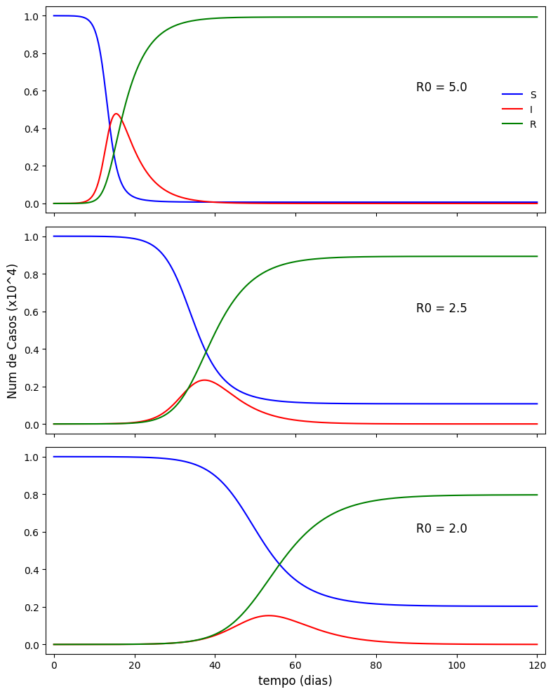

# Modelagem Matemática de uma Epidemia (Modelo SIR) 🦠

Projeto de Física Computacional focado na modelagem matemática da propagação de doenças infecciosas, utilizando o modelo SIR (Suscetível-Infectado-Removido).

## 👥 Integrantes
* Thiago Furriel de Castro
* Vítor Vargas dos Santos

## 💻 Sobre o Projeto
A análise numérica foi feita utilizando o método de Runge-Kutta de 4ª ordem (RK4) com a linguagem Python (NumPy e Matplotlib) para solucionar o sistema de equações diferenciais. O projeto explora:
* A simulação do modelo SIR clássico.
* O impacto da variação do número básico de reprodução ($R_0$).
* A extensão do modelo para incluir os efeitos da vacinação na população.

## 📈 Resultados da Simulação

Abaixo estão os resultados gerados pela simulação, mostrando a evolução temporal (em dias) das populações de Suscetíveis (S), Infectados (I) e Recuperados (R). 

O painel ilustra três cenários distintos variando a Taxa Básica de Reprodução ($R_0$). É possível observar claramente o comportamento do modelo e o efeito de "achatamento da curva" de infectados (linha vermelha) conforme o valor de $R_0$ diminui de 5.0 para 2.0:

## 📄 Estrutura
* `projetoSIR.ipynb`: Código fonte com as simulações matemáticas e geração de gráficos.
* `texto_projetoSIR.pdf`: Documento de fundamentação teórica que baseou a construção do modelo.

## 🚀 Como Executar

O projeto foi desenvolvido em formato de Notebook interativo, o que facilita muito os testes sem necessidade de instalar o Python na sua máquina.

1. Baixe o arquivo `.ipynb` deste repositório.
2. Acesse o [Google Colab](https://colab.research.google.com/) no seu navegador.
3. Faça o upload do arquivo para o Colab.
4. Execute as células de código sequencialmente para visualizar os cálculos matemáticos e a geração dos gráficos em tempo real.
